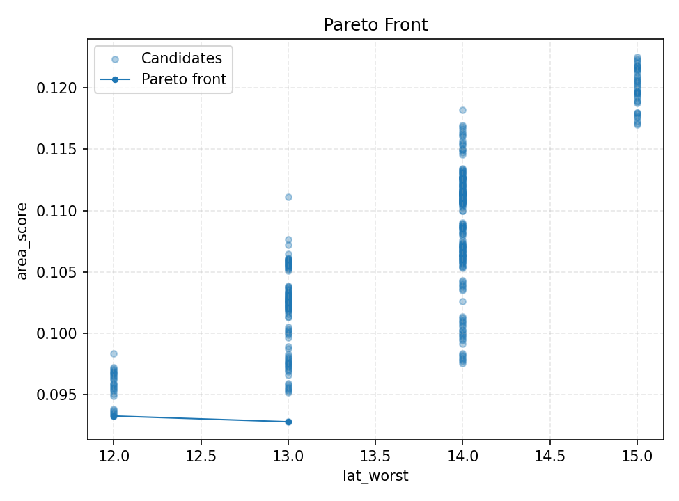

# HLS-ExpCORDIC-IP

Vitis HLS implementation of a synthesizable fixed-point `exp(x)` IP based on **hyperbolic CORDIC**.

## Overview

This project implements:

- `exp_cordic_ip(exp_in_t x) -> exp_out_t`
- Piecewise rule:
  - if `x < -8`, output `0`
  - otherwise approximate `exp(x)` (main evaluation range: `[-8, 0]`)
- CORDIC-based architecture with:
  - range reduction (`x = k*ln2 + r`)
  - hyperbolic rotation iterations
  - repeated hyperbolic indices (`s=4`, `s=13` in supported sequence)
  - gain compensation (`INV_K`) matched to `EXP_CORDIC_ITERS`

## Key Files

- `exp_cordic.h`: public types/macros and top declaration
- `exp_cordic.cpp`: core algorithm implementation
- `tb_exp_cordic.cpp`: C simulation testbench
- `hls_config.cfg`: Vitis HLS config for csim/syn
- `sweep_optuna/run_optuna_sweep.py`: automated design-space exploration
- `sweep_optuna/run_full.ps1`: one-shot sweep launcher

## Default Fixed-Point Config (current)

- `EXP_CORDIC_ITERS = 17`
- `EXP_IN_WL/IWL = 16/5`
- `EXP_OUT_WL/IWL = 21/1`
- `EXP_INT_WL/IWL = 23/4`

## Current Stable Core Status

The checked-in core has been manually tuned beyond the raw sweep result and has been re-validated locally.

- `csim` result:
  - `mse=2.313576275515e-11`
  - `ucb95=2.343615783293e-11`
- latest local `csynth` result for the checked-in core:
  - `lat_best/avg/worst = 10 / 10 / 10 cycles`
  - `II = 1`
  - `EstimatedClockPeriod = 6.854 ns`
  - `LUT = 3928`
  - `FF = 1208`
  - `DSP = 0`
  - `BRAM = 0`
  - `URAM = 0`

## Optuna Sweep Configuration

### Python dependency

```powershell
python -m pip install optuna
```

### Current default sweep space (from `run_optuna_sweep.py`)

- `iters`: `16..20`
- `out_wl`: `19..26`
- `out_iwl`: fixed `1`
- `int_wl`: `19,20,21,22,23,24,25,26`
- `int_iwl`: `3,4,5,6`
- Total combinations: `1280`

### Current optimization settings

- `objective`: `latency`
- `run_syn`: enabled in default full run
- weighted cost: `0.9 * latency_norm + 0.1 * area_norm`
- `threshold`: `2.4e-11`
- `samples`: `200000`
- supports `grid` and `tpe`

### Full run command (current default)

```powershell
powershell -ExecutionPolicy Bypass -File .\sweep_optuna\run_full.ps1
```

`run_full.ps1` current defaults:

- `Sampler=grid`
- `LimitTrials=0` (run all points)
- `Jobs=20`
- auto cleanup enabled:
  - `--reset-study-on-start`
  - `--clean-runs-on-start`
  - `--save-runs none`

### Custom sweep

```powershell
python .\sweep_optuna\run_optuna_sweep.py --help
```

## Best Result (latest local full-grid run)

Source: `sweep_optuna/results/sweep_summary.txt`

- Search space: 1280 points
- Passed configs: 347
- Objective: latency (0.9) + area (0.1)
- Best passing configuration:
  - `iters=17`
  - `out_wl=21`, `out_iwl=1`
  - `int_wl=23`, `int_iwl=4`
  - `mse=2.313576275515e-11`
  - `ucb95=2.343615783293e-11`
  - `lat_worst=12 cycles` (`120 ns` @ `10 ns` target clock)
  - `ii=[1,1]`
  - `lut=4214`, `ff=1497`, `dsp=0`, `bram=0`, `uram=0`
  - `est_slack_ns=2.807`

Note:
- The sweep best above is the best point from the automated search snapshot.
- The checked-in current source has since been manually refined and currently synthesizes to `10` cycles with the same fixed-point defaults shown above.

## Pareto Plot

Latest Pareto frontier snapshot:



## License

No license file is provided yet. Add one before public reuse if needed.
